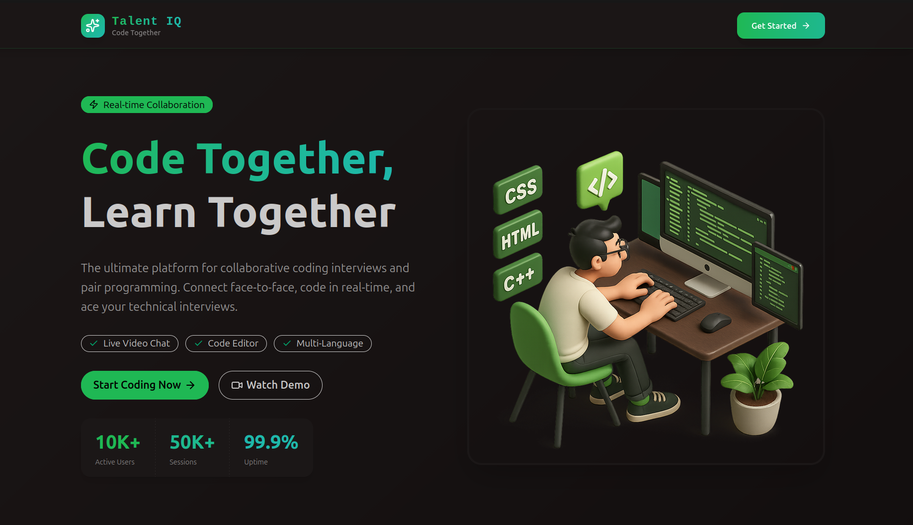
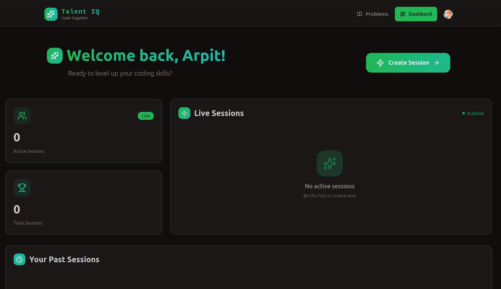
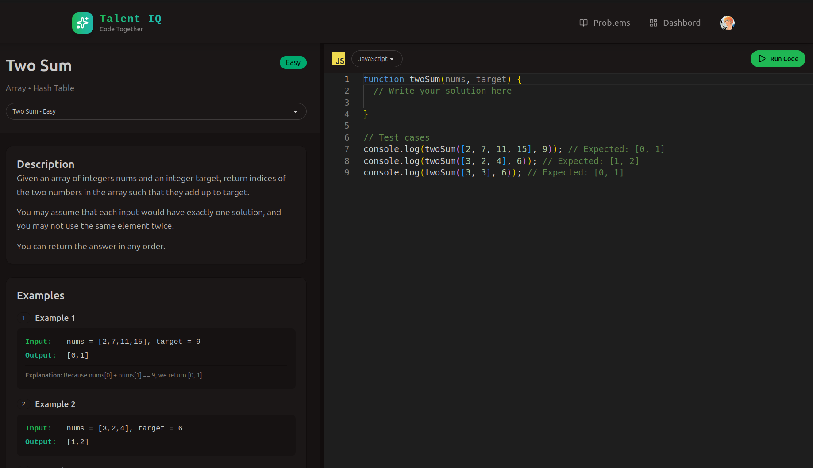

# Talent-IQ

<div align="center">


<br><br>

```text
████████╗ █████╗ ██╗     ███████╗███╗   ██╗████████╗    ██╗ ██████╗
╚══██╔══╝██╔══██╗██║     ██╔════╝████╗  ██║╚══██╔══╝    ██║██╔═══██╗
   ██║   ███████║██║     █████╗  ██╔██╗ ██║   ██║       ██║██║   ██║
   ██║   ██╔══██║██║     ██╔══╝  ██║╚██╗██║   ██║  ██   ██║██║▄▄ ██║
  ██║   ██║  ██║███████╗███████╗██║ ╚████║   ██║  ╚    ██╔╝╚████╔╝
   ╚═╝   ╚═╝  ╚═╝╚══════╝╚══════╝╚═╝  ╚═══╝   ╚═╝   ╚════╝  ╚══ ▀▀═╝
```


### AI-Powered Technical Interview & Coding Assessment Platform

</div>

---

# 🌟 Overview

Talent-IQ is a full-stack web application that simulates real-world software engineering interviews. It combines AI-assisted interviewing, secure candidate management, automated code execution, and an intuitive coding workspace into a single platform.

The project was built to explore modern full-stack development while solving a practical problem faced by students, recruiters, and educational institutions: conducting scalable and intelligent technical interviews.

---

# 🎯 Objectives

- Simulate technical interviews.
- Evaluate coding ability in real time.
- Execute code securely.
- Store interview sessions and candidate data.
- Provide an extensible architecture for future AI-driven feedback.

---

# 📸 Screenshots

## 🏠 Landing Page

<p align="center">

</p>

---

## 📊 Dashboard

<p align="center">

</p>

---

## 💻 Coding Environment

<p align="center">

</p>

---

# ✨ Core Features

- 🤖 AI-assisted interview workflow
- 💻 Browser-based coding environment
- 🌍 Multi-language code execution
- 🔐 Authentication and authorization
- 📝 Interview session management
- 📦 Modular REST API architecture
- ⚡ Express.js backend
- ⚛️ React + Vite frontend
- 🗄️ MongoDB persistence
- 📱 Responsive interface
- 🔄 Clean separation of frontend and backend
- 🚀 Scalable project structure

---

# 🏗️ System Architecture

```text
                        +------------------------+
                        |       Candidate        |
                        +-----------+------------+
                                    |
                             React + Vite UI
                                    |
                           HTTP / REST Requests
                                    |
+-------------------------------------------------------------------+
|                      Express.js Application                        |
+-------------------------------------------------------------------+
      |               |                  |                |
      v               v                  v                v
+-----------+   +-------------+   +-------------+   +--------------+
| Auth API  |   | Interview   |   | Code Runner |   | AI Services  |
+-----------+   +-------------+   +-------------+   +--------------+
          \            |                |              /
           \           |                |             /
            +----------+----------------+------------+
                               |
                               v
                        MongoDB Database
```

---

# ⚙️ Tech Stack

| Category | Technologies |
|-----------|--------------|
| Frontend | React, Vite, JavaScript, CSS |
| Backend | Node.js, Express.js |
| Database | MongoDB, Mongoose |
| APIs | REST APIs |
| Services | AI Integration, Code Execution |

---

# 📂 Project Structure

```text
talent-IQ
│
├── frontend
│   ├── src
│   │   ├── components
│   │   ├── pages
│   │   ├── hooks
│   │   ├── api
│   │   ├── lib
│   │   └── data
│   └── package.json
│
├── backend
│   ├── src
│   │   ├── controllers
│   │   ├── routes
│   │   ├── middleware
│   │   ├── models
│   │   ├── lib
│   │   └── config
│   └── package.json
│
├── images
└── README.md
```

---

# 🚀 Installation

## Requirements

- Node.js 18+
- npm
- MongoDB

## Clone

```bash
git clone https://github.com/vermaarpit14/talent-IQ.git
cd talent-IQ
```

## Backend

```bash
cd backend
npm install
npm run dev
```

## Frontend

```bash
cd frontend
npm install
npm run dev
```

---

# 🔑 Environment Variables

```env
MONGODB_URI=
JWT_SECRET=
PORT=
AI_API_KEY=
```

---

# 📡 Typical Workflow

```text
Candidate Login
       │
       ▼
Interview Session
       │
       ▼
Coding Question
       │
       ▼
Code Execution
       │
       ▼
Evaluation
       │
       ▼
Results Stored
```

---

# 💡 Design Principles

- Modular architecture
- Separation of concerns
- RESTful communication
- Reusable React components
- Scalable backend organization
- Maintainable codebase

---

# 🚧 Future Improvements

- Video interview integration
- Screen sharing
- AI feedback generation
- Recruiter analytics
- Leaderboards
- Docker support
- CI/CD pipeline
- Kubernetes deployment
- WebSocket collaboration
- Automated plagiarism detection

---

# 📚 Learning Outcomes

- Full-stack application development
- REST API design
- React architecture
- Express.js backend development
- Authentication & authorization
- MongoDB data modeling
- AI service integration
- Modular software engineering
- Project structuring
- Deployment fundamentals

---

# 👨‍💻 Author

**Arpit Verma**

---

# 📜 License

MIT License